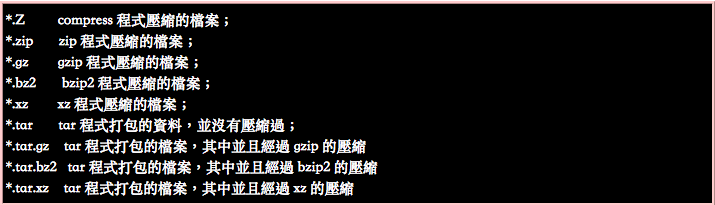

# tar

kaishen, 19 mar, 2018

First of all, we need to get some sense from different suffix like ".zip", ".tar", ".tar.gz", etc.

The follow picture is taken from this [link](http://linux.vbird.org/linux_basic/0240tarcompress.php).



The useful command parameter is shown here.


**Noticed**: normally, we put the `-f` at last becasue it can have multiple argument. 

##  Common used sample

**Un-compress** the given compressed file to **specific location**.

```shell
tar -xzvf xxx.tar.gz -C specific_location
```


**Compress** specific folder into a file

```shell
tar -czvf <give a name>.tar.gz source_folder1 source_folder2 ...
```


Further used sample will be added when I use them next time.


